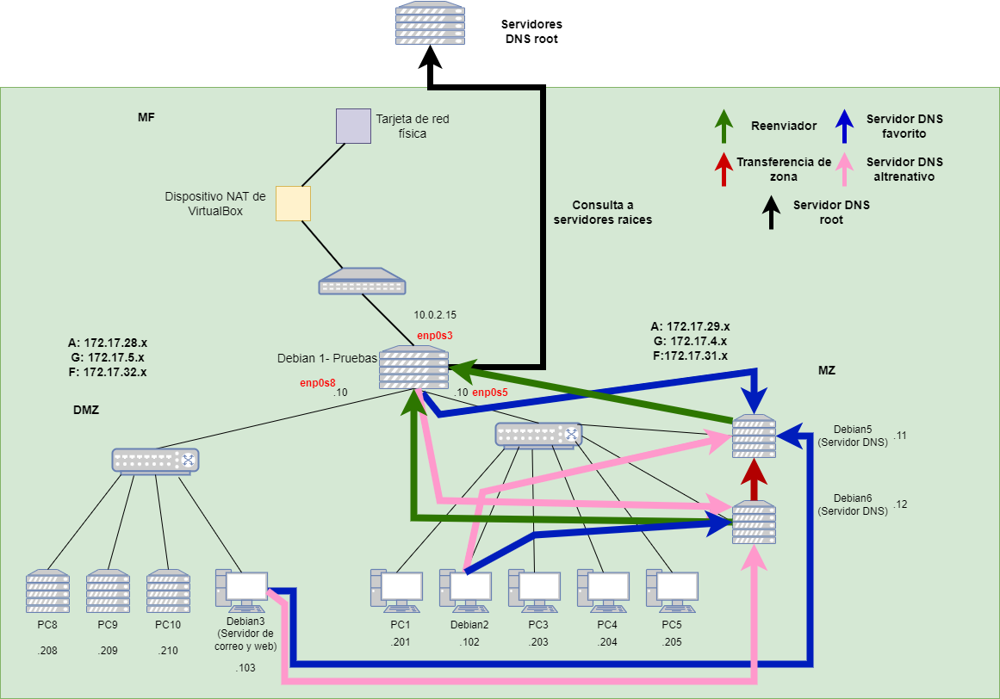
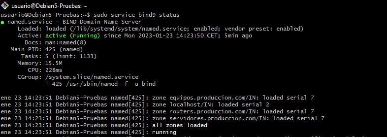
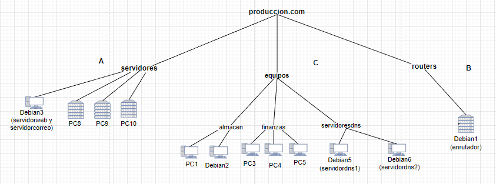
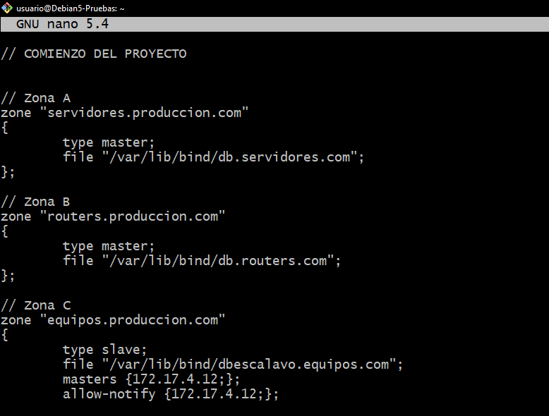
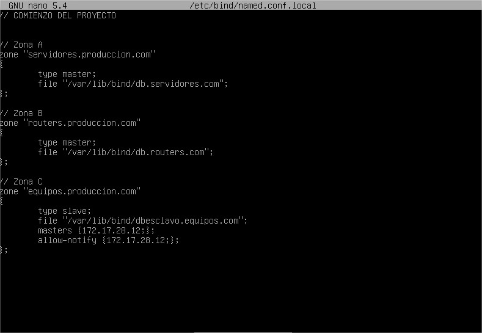
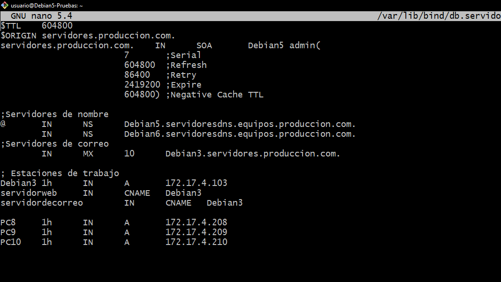
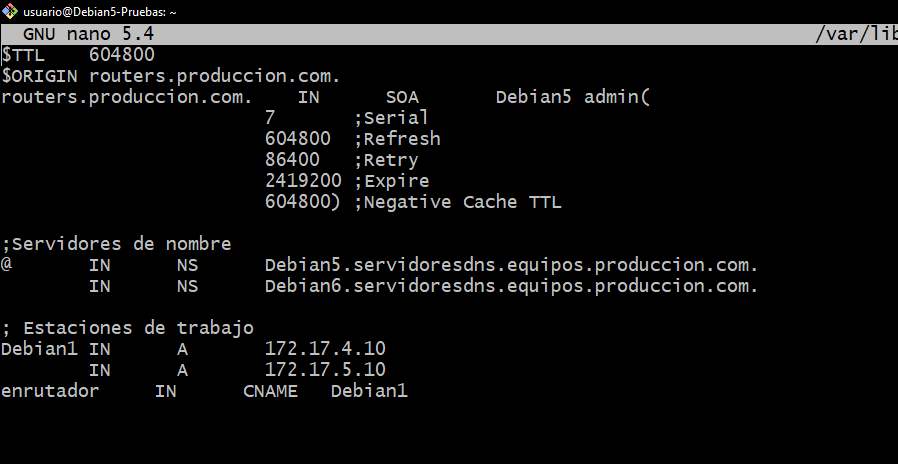
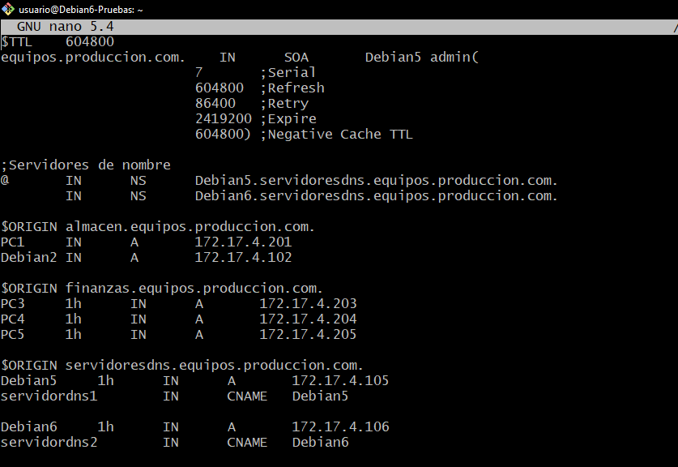

# Implantación del servicio DNS en el entorno de trabajo
#### SER - Guillermo Bárcena López, Francisco Mejías de Matos y Alvaro Jimenez talaverón  
.jpeg)
---
Este es un proyecto el cuál hemos realizado con el fin de poner en práctica todo lo aprendido sobrer DNS y resolucion de nombres. Para explicarlo utilizaremos el guión proporcionado por nuestro profesor Jose Luis Rodríguez.

---
1. **Figura con la infraestructura del entorno**  
La infraestructura que hemos desarrollado ha sido la siguiente: 

[Enlace al diagrama](https://drive.google.com/file/d/1OGA-V4_20N8UnIGlXNveywVdCZCEsaSm/view?usp=sharing) 
Como podemos ver en la imagen el escenario esta dividido en 2 redes, la DMZ con 4 equipos, y la MZ con 5 y los dos servidores DNS, a todo esto se le suma un router que interconecta las dos redes y les da salida a internet a través de una red NAT. El direccionamiento se hará intercalando el método estático que lo utilizarán Debian5-pruebas, Debian6-pruebas y Debian1-pruebas, y los demás equipos obtendrán su configuración mediante DHCP. 
La DMZ y Debian1-pruebas tendrá como servidor DNS favorito a Debian5 y como secundario a Debian6-pruebas, por otro lado la MZ lo tendrá al contrario.  
Los servidores DNS tendrán de reenviador al Debian1-pruebas que resolverá los nombres de fuera de nuestra red accediendo a los Servidores DNS root.
---
2. **Tener Instalado el servicio DNS en Debian5-pruebas y en Debian6-pruebas**  
Lo debemos tener instalado en los dos equipos para dividir la resolución de nombres por igual y repartirse el trabajo entre los dos, además nos proporciona una resistencia mayor a los fallos, ya que, si falla un servidor estará el otro para suplirlo. 
Esto se puede comprobar mediante el comando "sudo service bind9 status" y debería salirnos este resultado.

---
3. **Espacio de nombres**  
Este es nuestro espacio de nombres que explicaremos a continuación: 
 
[Enlace al diagrama](https://drive.google.com/file/d/1t0toJ2aAeeb92nNTWth2CG8ceuFkpZOH/view?usp=sharing) 
Todas las máquinas virtuales de las que disponemos, es decir las DebianX-pruebas estan dotadas de su correspondiente nombre, además de las maquinas adicionales para completar la red. Los equipos de cada zona no han sido colocados al azar, ya que tienen influencia en el balanceo de carga del que hablaremos en el punto 7.  
Llegamos, y superamos los dominios hasta tercer nivel en la zona c, donde un ejemplo sería: ("PC1.almacen.equipos.produccion.com).  
Hablando de que hemos puesto en cada zona:
- En la zona A (Servidores), basicamente se encuentran todos los servidores, excepto los DNS.
- En la zona B (Routers), hemos colocado los routers de los que disponemos.
- En la zona C (Equipos), hemos colocado todos los equipos y los servidores DNS. Está dividida en 3 apartados:
  - Almacen: PC1 y Debian2-Pruebas formarán parte de él.
  - Finanzas: PC3, PC4, PC5 perrtenecerán a este subgrupo.
  - Servidoresdns: Contendrá a Debian5-Pruebas Debian6-Pruebas.
---
4. **Zonas directas**  
En las zonas directas Debian5-pruebas será el servidor principal para las zonas A y B y secundario para C, contrariamente, Debian6-pruebas será el servidor secundario para las zonas A y B y principal Para la zona C. 
Además debemos acordarnos de colocar la línea de las notificaciones en las zonas secundarias 
A continuación, vamos a dejar las capturas del archivo /etc/bind/named.conf.local de cada uno de nosotros. 
- Debian5-Pruebas:
  - Fran: 
  
  - Guillermo: 
   
  - Álvaro:
  
  
- Debian6-Pruebas:
  - Fran: 
  
  - Guillermo: 
   .PNG)
  - Álvaro: 
  

Una vez que ya tenemos estos archivos creados hay que configurar los archivos db.xxxxxx 
- dbservidores (Que se encuentra en el Debian5.pruebas) 
  - Fran: 
   
  - Guillermo: 
   
  - Álvaro: 

-db.routers (Que se encuentra en el Debian5-pruebas) 
  - Fran: 
   
  - Guillermo: 
  
  - Álvaro:
  
-db.equipos (Que se encuentra en el Debian6-pruebas) 
  - Fran: 
   
  - Guillermo: 
  
  - Álvaro:  
 
