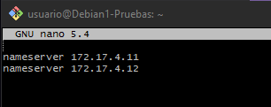
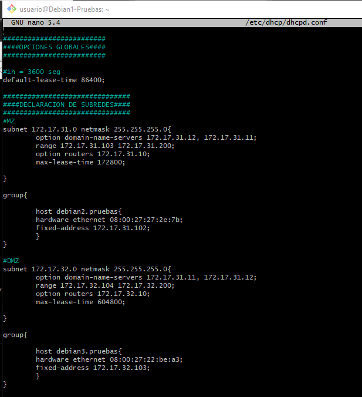
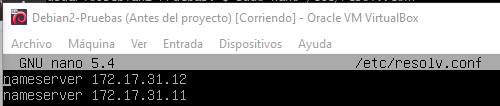

# Implantación del servicio DNS en el entorno de trabajo
#### SER - Guillermo Bárcena López, Francisco Mejías de Matos y Alvaro Jimenez talaverón  
.jpeg)
---
Este es un proyecto el cuál hemos realizado con el fin de poner en práctica todo lo aprendido sobrer DNS y resolucion de nombres. Para explicarlo utilizaremos el guión proporcionado por nuestro profesor Jose Luis Rodríguez.

---
1. **Figura con la infraestructura del entorno**  
La infraestructura que hemos desarrollado ha sido la siguiente: 

[Enlace al diagrama](https://drive.google.com/file/d/1OGA-V4_20N8UnIGlXNveywVdCZCEsaSm/view?usp=sharing) 
Como podemos ver en la imagen el escenario esta dividido en 2 redes, la DMZ con 4 equipos, y la MZ con 5 y los dos servidores DNS, a todo esto se le suma un router que interconecta las dos redes y les da salida a internet a través de una red NAT. El direccionamiento se hará intercalando el método estático que lo utilizarán Debian5-pruebas, Debian6-pruebas y Debian1-pruebas, y los demás equipos obtendrán su configuración mediante DHCP. 
La DMZ y Debian1-pruebas tendrá como servidor DNS favorito a Debian5 y como secundario a Debian6-pruebas, por otro lado la MZ lo tendrá al contrario.  
Los servidores DNS tendrán de reenviador al Debian1-pruebas que resolverá los nombres de fuera de nuestra red accediendo a los Servidores DNS root.
---
2. **Tener Instalado el servicio DNS en Debian5-pruebas y en Debian6-pruebas**  
Lo debemos tener instalado en los dos equipos para dividir la resolución de nombres por igual y repartirse el trabajo entre los dos, además nos proporciona una resistencia mayor a los fallos, ya que, si falla un servidor estará el otro para suplirlo. 
Esto se puede comprobar mediante el comando "sudo service bind9 status" y debería salirnos este resultado.

---
3. **Espacio de nombres**  
Este es nuestro espacio de nombres que explicaremos a continuación: 
 
[Enlace al diagrama](https://drive.google.com/file/d/1t0toJ2aAeeb92nNTWth2CG8ceuFkpZOH/view?usp=sharing) 
Todas las máquinas virtuales de las que disponemos, es decir las DebianX-pruebas estan dotadas de su correspondiente nombre, además de las maquinas adicionales para completar la red. Los equipos de cada zona no han sido colocados al azar, ya que tienen influencia en el balanceo de carga del que hablaremos en el punto 7.  
Llegamos, y superamos los dominios hasta tercer nivel en la zona c, donde un ejemplo sería: ("PC1.almacen.equipos.produccion.com).  
Hablando de que hemos puesto en cada zona:
- En la zona A (Servidores), basicamente se encuentran todos los servidores, excepto los DNS.
- En la zona B (Routers), hemos colocado los routers de los que disponemos.
- En la zona C (Equipos), hemos colocado todos los equipos y los servidores DNS. Está dividida en 3 apartados:
  - Almacen: PC1 y Debian2-Pruebas formarán parte de él.
  - Finanzas: PC3, PC4, PC5 perrtenecerán a este subgrupo.
  - Servidoresdns: Contendrá a Debian5-Pruebas Debian6-Pruebas.
---
4. **Zonas directas**  
En las zonas directas Debian5-pruebas será el servidor principal para las zonas A y B y secundario para C, contrariamente, Debian6-pruebas será el servidor secundario para las zonas A y B y principal Para la zona C. 
Además debemos acordarnos de colocar la línea de las notificaciones en las zonas secundarias 
A continuación, vamos a dejar las capturas del archivo /etc/bind/named.conf.local de cada uno de nosotros. 
- Debian5-Pruebas:
  - Fran: 
  
  - Guillermo: 
   
  - Álvaro: 
  
  
- Debian6-Pruebas:
  - Fran: 
  
  - Guillermo: 
   .PNG)
  - Álvaro: 
  

Una vez que ya tenemos estos archivos creados hay que configurar los archivos db.xxxxxx 
- dbservidores (Que se encuentra en el Debian5.pruebas) 
  - Fran: 
   
  - Guillermo: 
   
  - Álvaro: 

- db.routers (Que se encuentra en el Debian5-pruebas) 
  - Fran: 
   
  - Guillermo: 
  
  - Álvaro: 
   
- db.equipos (Que se encuentra en el Debian6-pruebas) 
  - Fran: 
   
  - Guillermo: 
  
  - Álvaro:  
 
 ---
 5. **Zonas inversas**  
Las zonas inversas actúan al contrario que las zonas directas, es decir nos entregan el nombre dns a partir de la dirección IP. A continuación os dejaremos fotos de las actualizaciones que hemos realizado en el archivo /etc/bind/named.conf.local:

- Debian5-Pruebas:
  - Fran: 
  
  - Guillermo: 
   
  - Álvaro: 
     
  
- Debian6-Pruebas:
  - Fran: 
  
  - Guillermo: 
   
  - Álvaro: 
     

Una vez que ya tenemos estos archivos creados hay que configurar los archivos db.MZ y db.DMZ 
- db.DMZ (Que se encuentra en el Debian5.pruebas) 
  - Fran: 
   
  - Guillermo: 
   
  - Álvaro: 
   
- db.MZ (Que se encuentra en el Debian6-pruebas) 
  - Fran: 
   
  - Guillermo: 
  
  - Álvaro: 
   

---
6. **Servidor DNS de solo caché**  

Ahora mismo nuestra red no resuelve nombres fuera de nuestro dominio, es decir si nosotros hicieramos "host www.google.es", es completamente imposible que nos resuelva. La mejor manera de arreglar esto es configurando un servidor DNS de solo caché, que en nuestro caso será el Debian1-pruebas. Este servidor realizará las resoluciones que Debian5-pruebas y Debian6-pruebas no puedan. 
Para poder hacer esto lo primero que habrá que hacer, logicamente, será descargarnos el servicio bind9 en Debian1-pruebas, y al contrario de lo que mucha gente piensa no configuraremos nada, porque sin tocar nada el primer archivo donde va a mirar es el que contiene los servidores DNS raiz y podrá resolver los nombres fuera de su red. 

Lo que sí que tenemos que configurar son los reenviadores del Debian6-pruebas y Debian5-pruebas que se configuran en el fichero /etc/bind/named.conf.options, A continuación se muestran las capturas:  
- Debian5-Pruebas:
  - Fran: 
  
  - Guillermo: 
   
  - Álvaro: 
  
  
- Debian6-Pruebas:
  - Fran: 
  
  - Guillermo: 
   
  - Álvaro: 
  

---
7. **Resolución DNS en los clientes**  
En este apartado explicaremos el balanceo de carga que hemos realizado, es decir, la mitad de equipos tendrán como servidor DNS preferido al Debian5 y como alternativo al Debian6 y la otra mitad justo al contrario, de esta forma conseguimos que la red este balanceada y ambos servidores reciban la misma carga y así no se saturen.
- Equipos que tendrán a Debian5 como preferido y a Debian6 como alternativo: Debian1, PC8, PC9, PC10, Debian3.
- Equipos que tendrán a Debian6 como preferido y a Debian5 como alternativo: PC1, Debian2, PC3, PC4, PC5.   
Así mismo, Debian5 y Debian6 se tendrán como preferido a ellos mismos y como alternativo al otro. A continuación pondremos captura de pantalla del fichero /etc/resolv.conf de cada uno de ellos, en este fichero se configura los servidores DNS en orden de preferencia.

- Debian5-Pruebas:
  - Fran: 
  
  - Guillermo: 
   
  - Álvaro: 
  
  
- Debian6-Pruebas:
  - Fran: 
  
  - Guillermo: 
   
  - Álvaro: 
    
  
Debian 1 tendrá su configuración estática así que su resolv.conf se configurará de forma manual, y como ya hemos dicho antes, tendrá al Debian5 como preferido y al Debian6 como alternativo. A continuación se muestra una foto de cada uno de nuestros ficheros:
- Debian1-Pruebas:
  - Fran: 
  
  - Guillermo: 
   
  - Álvaro: 
    
  
La DMZ, es decir, los equipos que tiene a Debian5 como servidor DNS preferido, está representada por Debian3-Pruebas y la MZ, es decir, los equipos que tiene a Debian6 como servidor DNS preferido, está representada por Debian2-Pruebas. Esta configuración se hará mediante DHCP, aprendido en la unidad anterior, para ello editaremos el fichero /etc/dhcp/dhcpd.conf en el Debian1:
- Debian1-Pruebas:
  - Fran: 
  
  - Guillermo: 
   
  - Álvaro: 
    
  
Como vemos, reservamos una IP al Debian2 y al Debian3 y ponemos como servidor DNS preferido y alternativo el que corresponda según sea la MZ o la DMZ. El range empieza en .103 y .104 debido a que si lo empezamos en 100 o en algun rango que incluya las IPs que hemos reservado, nos dará un error. Una vez configurado todo esto, obtendremos la siguiente configuración en los clientes:
- Debian2-Pruebas:
  - Fran: 
  
  - Guillermo: 
   
  - Álvaro: 
    
  
- Debian3-Pruebas:
  - Fran: 
  
  - Guillermo: 
   
  - Álvaro: 
    
  
  ---
8. **Registros especiales**  
Los registros especiales que nosotros vamos a poner son NS, CNAME, MX y SOA. Para estos registros solo vamos a subir una captura, ya que se pueden ver por separado en capturas anteriores. 

- Registros NS: Representa a los servidores DNS del espacio de nombres, en nuestro caso son el Debian5-pruebas y Debian6-pruebas. 
    
- Registros CNAME: Se usa para añadir alias a ciertos equipos equipos y que sean accesibles por varios nombres, por ejemplo nuestro router será accedido mediante Debian1-pruebas.routers.producción.com o cambiando el último nivel por enrutador. 
   
   
    

- Registros MX: Se usa para reconocer rápidamente los servidores de correo del dominio, que en nuestro caso será Debian3-pruebas. 
   

- Registros SOA: Define algunas caracterísiticas de cada zona que describiré a continuación, además debe ser el primer resgistro de cada zona. Este es nuestro registro del servidores.produccion.com: 
  
  - Servidores.produccion.com: Es basicamente el nombre del dominio e ira cambiando según donde nos encontremos, en db.equipos sería equipos.produccion.com, auqnue también se puede sustituir por un @ que representa basicamente la directiva @ORIGIN. 
  
  - Debian5: Se trata del servidor DNS primario de la zona. 
 
  - admin: se trata de la dirección de correo eléctronico de la persona responsable de la zona. 
  
  - Serial: Es la versión del archivo, si aumenta es que el archivo ha cambiado, hemos elegido el número 7 para ir aumentándolo de 7 en 7, ya que pensamos que se diferencia mucho mejor que de uno en uno. 
  
  - Refresh: Es el tiempo que se da entre cada vez que los servidores secundarios verifican si ha habido algún cambio en los primarios para hacer la transferencia de zona. En nuestro caso es de 7 días, ya que somos una empresa en asentada y no solemos tener necesidad de introducir resgistros nuevos.
  
  - Retry: Es el tiempo que tarda el servidor secundario en volver a intentar una transferencia fallida. En nuestro caso es de un día, puede parecer bastante tiempo pero realmente se debe dejar un tiempo primordial que nos permita solucionar el problema. 
   
  - Expire: Es el tiempo que durarán las peticiones del servidor esclavo al primario, mientras este no responda. En nuestro caso es de un mes, un tiempo bastante largo, porque no comtemplamos que el servidor primario no responda, si eso pasa, algo va mal. 
  
  - Negative Cache TTL: Tiempo que otros servidores guardan en caché la zona. En nuestro caso es de siete días para que tengan bastante tiempo ese extra de velocidad.

---
9. **Transferencias de zonas** 
En este proyecto haremos transferencias de zona desde el Debian6 al Debian5, aunque en la ssolución real se tendría que hacer en ambos sentidos. Para empezar, en el fichero /etc/bind/named.conf.local, cuando definamos las zonas, tendremos zona masters y zonas esclavas. en estas zonas esclavas habrá que esspecificar cual es la IP del servidor DNS master de esa zona, que será el cual nos haga las tranferencias de zona. También, dentro de esa zona debemos añadir "allow-notify", sirve para que cada vez que se cargue la zona, el equipo pregunte a la IP indicada sobre el serial del registro SOA, el cual si se cambia, se hará la transferencia de zona. A continuación las capturas:

  - Fran: 
  
  - Guillermo: 
   
  - Álvaro: 
    
  
 También debemos tener activadas transferencias de zona en el Debian6, es decir, el cual las va a enviar. 
   - Fran: 
  
   - Guillermo: 
   
   - Álvaro: 
    

Una vez hecho todo esto, reiniciamos el servicio y al hacer _ls_ debemos tener el archivo esclavo.
   - Fran: 
  
   - Guillermo: 
   
   - Álvaro: 
    
  
  ---
  10. **Comprobaciones** 
Es el momento de hacer las comprobaciones necesarias para ver que todo funciona:  
- Comprobacion de un equipo del dominio: 
   - Fran: 
  
   - Guillermo: 
   
   - Álvaro: 
    
  
- Comprobacion de los servidores de correo: 
   - Fran: 
  
   - Guillermo: 
   
   - Álvaro: 
    
  
- Comprobacion de los servidores de nombre: 
   - Fran: 
  
   - Guillermo: 
   
   - Álvaro: 
    
  
- Comprobacion de los registros Cname: 
   - Fran: 
  
   - Guillermo: 
   
   - Álvaro: 
      
  
- Comprobacion de las zonas inversas: 
   - Fran: 
  
   - Guillermo: 
   
   - Álvaro: 
    
  
- Comprobacion de resoluciones fuera del dominio: 
   - Fran: 
  
   - Guillermo: 
   
   - Álvaro: 
    
